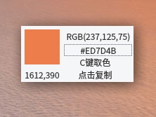

# Qt 海天鹰颜色拾取器
  
Linux 平台基于 Qt 的颜色拾取程序。  
C键取色，点击RGB或Hex颜色值复制颜色文本，鼠标拖动移动界面，Ctrl+Q退出。  
已编译好的 HTYColorPicker 程序适用64位Linux系统Qt5环境，双击运行，其他版本请自行编译。  

1.1 版：  
使用 QImage=QPixmap.toImage() 方法，取消保存到本地图片，消除延时，感谢 Rekols@deepin.org 。  

缺点：  
需要激活窗体才能使用热键。  
